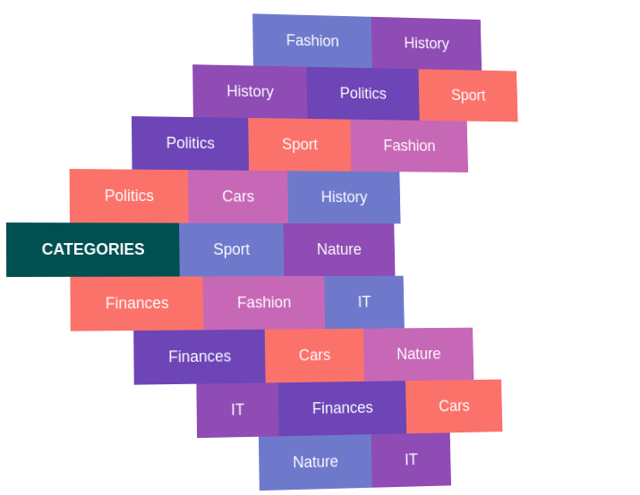

# ButtonFly

Small, specific but cool-looking UI component written in vanilla JS.



## Demo

You can try the component [on the demo page](https://yamnikov-oleg.github.io/buttonfly/demo.html).

## Install

To install the component, simply copy three files into your project and link them into your page:

* `buttonfly.js`
* `buttonfly.css`
* `buttonfly.theme.css`

## Usage

List the menu items inside one block:

```html
<div id="buttonfly">
  <a href="javascript:void(0)">Categories</a>
  <a href="javascript:void(0)">Politics</a>
  <a href="javascript:void(0)">Finances</a>
  <a href="javascript:void(0)">Sport</a>
  <a href="javascript:void(0)">Cars</a>
  <a href="javascript:void(0)">Fashion</a>
  <!-- ... -->
</div>
```

The first item will be the _main button_ of the menu. The rest will be _child buttons_.

Then initialize the component:

```js
var bf = new ButtonFly(document.getElementById('buttonfly'));
```

That's it!

## Configuration

If you want to tweak the component's behaviour, pass options as a second argument to the constructor:

```js
var bf = new ButtonFly(document.getElementById('buttonfly'), {
  hover3dEffect: true,
});
```

### Available options:

* `initiallyShown` - open up the menu after the component is initialized. If set to `false`, menu will be in closed state after initialization.

  __Default__: `false`

* `hideOnScrolling` - close menu when user scrolls the page.

  __Default__: `true`

* `onlyWrapMainButton` - when enabled, the root element of the component will have size of the main button. All other buttons will be displayed outside of component's boundaring, overflowing it. When disabled, the root element will wrap all the buttons of menu.

  __Default__: `false`

* `rowLeftMarginStep` - step in pixels, by which rows' indentation is increased from middle to edges.

  __Default__: `72`

* `transitionDuration` - duration of opening and closing animation in seconds.

  __Default__: `0.15`

* `transitionDelay` - step of animation delay between closer button and farther button. This delay ensures that opening and closing animation propagates from main to button to edge button.

  __Default__: `0.05`

* `toggleOnMainButton` - when enabled, clicking on the main button will open/close the menu.

  __Default__: `true`

* `buttonsVariations` - number of variations of child buttons' appearances. Each child button of the component will get `buttonfly__button--var<i>` class, where `<i>` - is "random" number from 0 to N-1, where N - is number of buttons variations.

  __Default__: `5`

* `hover3dEffect` - when enabled, menu will display cool-looking 3d effect on cursor hovering. To see the effect check out [demo page](https://yamnikov-oleg.github.io/buttonfly/demo.html).

  __Default__: `false`

* `rotationPixPerDeg` - how much pixels must cursor move to make the component rotate by 1 degree in 3d space? This options has no meaning when 3d effect is disabled.

  __Default__: `96`

* `rotationMaxX` - maximum number of degrees, the menu can rotate by X axis. This options has no meaning when 3d effect is disabled.

  __Default__: `20`

* `rotationMaxY` - maximum number of degrees, the menu can rotate by Y axis. This options has no meaning when 3d effect is disabled.
perspective: 1000,

  __Default__: `20`

* `onInit` - callback function, which recieves one argument of type `ButtonFly`. When component is initalized, this callback will recieve the initialized instance of component.

  __Default__: `null`

## Styling

If you want to tweak the appearance of ButtonFly, edit `buttonfly.theme.css` however you like it.

## API

### Properties of `ButtonFly`

* `element` - the root html element of the component.
* `wrap` - the wrapping element placed inside the root element.
* `rowElements` - an object, mapping row numbers to row elements. The middle row is numbered 0, the rows to the top are numbered 1, 2, 3 etc., the rows to the bottom are numbered -1, -2, -3 etc.
* `mainButton` - the element of main button.
* `childButtons` - the list of elements of all buttons except the main one.
* `options` - the options object of the instance, including default ones. __Please__, do not edit this object.

### Methods of `ButtonFly`

* `show()` - open up the menu.
* `hide()` - hide the menu.
* `isShown()` - returns `true` if menu is open.
* `toggle()` - open the menu if it's closed or close if it's open.
